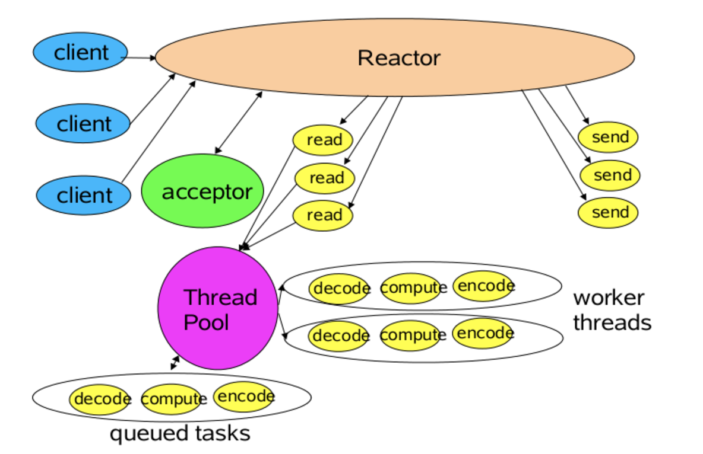
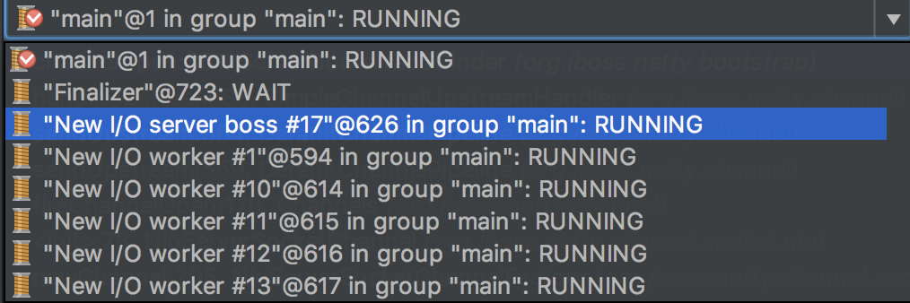
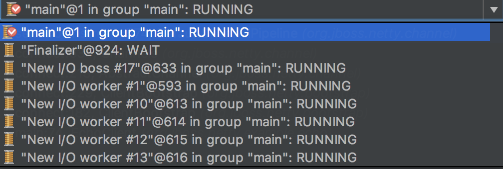

#Netty中的Boss和Worker

Netty中服务端／客户端在启动的时候会专门启动两类线程（netty-3.10的Echo例子中是这样子，但是到netty 4.x之后 客户端只其起了一个线程）: Boss线程和Worker线程。在服务端，Boss线程主要负责处理连接上来的请求，然后讲该连接分发给Worker来处理网络读写；在客户端，Boss线程主要负责处理连接服务器，然后讲连接分发给Worker来处理网络读写。Boss和Worker主要来自于Reactor模式。

##Reactor模式

一张图说明Reactor的整体架构。

关于reactor模式，请自行百度。这里说下我的理解：在Netty中，Boss线程相当于acceptor，而Worker则主要是负责read和send。

在Netty服务端启动后，其后台线程如下图所示，

从图中可以看出，除了用户线程（main),还有一个Boss线程和N个Worker线程(缺省情况下N=16)

在Netty客户端启动后，其后台线程如下图所示，

从图中可以看出，除了用户线程（main),还有一个Boss线程和N个Worker线程(缺省情况下N=16)

#AbstractNioSelector
本文主要分析的是Netty NIO Boss线程和Worker线程的处理逻辑，主逻辑主要集中在NioClientBoss，NioServerBoss和NioWorker三个类，其中服务端，客户端的Worker逻辑基本保持一致，所以不用区分；而服务端的Boss和客户端Boss的逻辑略有不同，所以分为了两个类（在netty 4.x中， 又做了合并，只有一个EventLoop类了，这里暂且不说）。

不管是NioClientBoss，NioServerBoss，还是NioWorker，都继承自AbstractNioSelector。本小节先分析下AbstractNioSelector这个类。

由于AbstractNioSelector主要是Boss线程和Worker线程的处理逻辑类，所以其核心在重写的Runnable的run方法上，继承自他的 NioClientBoss，NioServerBoss，还是NioWorker run方法都是AbstractNioSelector的，并没有再进行重写。

下面是AbstractNioSelector的run方法主要源码

        thread = Thread.currentThread();
        Selector selector = this.selector;
        selectReturnsImmediately = 0;
        for (;;) {
                int selected = select(selector);
                if (selected == 0 && !wakenupFromLoop && !wakenUp.get()) {
                    selectReturnsImmediately ++;
                } else {
                    selectReturnsImmediately = 0;
                }
                if (SelectorUtil.EPOLL_BUG_WORKAROUND) {
                    if (selectReturnsImmediately == 1024) {
                        rebuildSelector();
                        selector = this.selector;
                        continue;
                    }
                } else {
                    selectReturnsImmediately = 0;
                }
                processTaskQueue();
                process(selector);
        }

首先是对selector对象的轮询(mark: selector记住是每一个NioServerBoss，NioClientBoss和NioWorker都有一个的，由于每一个Boss线程和每一个Worker线程都是new出来的，即每一个Boss线程和Worker都有一个selector)，

    int selected = select(selector);
其内部方法为

    selector.select(SELECT_TIMEOUT);
为带超时的阻塞select()方法。不过需要注意的一点是，在NioServerBoss内部重写了该方法，为

    selector.select();
为阻塞的select()方法，这也和是服务端有关。

如果长期select方法返回的是0，则需要调用rebuildSelector方法重建selector，netty给的阈值是1024；rebuildSelector的思想是重新new一个Selector，然后将旧的Selector的keys赋值给新的Selector，然后将新的Selector赋给AbstractNioSelector的selector属性。至于为什么是需要这样一种方法，netty源码注释上描述是 java NIO的一个bug，还没去深究，暂且不论。

接下来便是两个核心方法：

    processTaskQueue();
    process(selector);

* processTaskQueue主要是从 taskQueue 任务队列中获取任务，然后执行。taskQueue任务队列是 AbstractNioSelector 的属性，所以每一个Boss线程和Worker线程都会有一个自己的taskQueue,只要调用相关的方法将task投到队列中，Boss线程和Worker线程 就能在 每一次 循环中 处理这些任务。processTaskQueue方法的主体框架是一样的，不同的是NioServerBoss，NioClientBoss和NioWorker中定义的RegisterTask 任务类，在下面分别说明各个类的时候再对其做简单描述吧。

* process(selector) 主要是处理多路复用器Selector，NioServerBoss，NioClientBoss和NioWorker的处理逻辑各不相同，在下面分别说明各个类的时候再对其做简单描述吧。

##NioServerBoss
NioServerBoss是服务端的Boss类，其核心run方法跟其父类 AbstractNioSelector 保持一致，重点分析下其 process(selector) 方法，核心代码如下：

        Set<SelectionKey> selectedKeys = selector.selectedKeys();
        if (selectedKeys.isEmpty()) {
            return;
        }
        for (Iterator<SelectionKey> i = selectedKeys.iterator(); i.hasNext();) {
            SelectionKey k = i.next();
            i.remove();
            NioServerSocketChannel channel = (NioServerSocketChannel) k.attachment();
            
            for (;;) {
                SocketChannel acceptedSocket = channel.socket.accept();
                if (acceptedSocket == null) {
                    break;
                }
                registerAcceptedChannel(channel, acceptedSocket, thread);
            }
        }

从代码可以看出，NioServerBoss主要处理的是socket的accept，由于这些channel设置了非阻塞，socket.accept()方法不会阻塞，如果没有连接上来，则直接返回空，这样就可以跳出 for(;;)这一死循环了。接下来就是处理连接上来的socket了，调用的是 registerAcceptedChannel 方法，该方法主要是创建了一个NioAcceptedSocketChannel，然后调用worker的register方法，创建一个workder的 RegisterTask任务(捎上NioAcceptedSocketChannel)，将其投入到worker的 taskQueue 中。

####NioServerBoss$RegisterTask
NioServerBoss中的RegisterTask主要是做服务端的地址的bind操作，核心代码如下：
    
    channel.socket.socket().bind(localAddress, channel.getConfig().getBacklog());
    channel.socket.register(selector, SelectionKey.OP_ACCEPT, channel);

##NioClientBoss
NioClientBoss的process方法源码如下

        processSelectedKeys(selector.selectedKeys());
        long currentTimeNanos = System.nanoTime();
        processConnectTimeout(selector.keys(), currentTimeNanos);

其中processSelectedKeys方法核心代码逻辑

        if (selectedKeys.isEmpty()) {
            return;
        }
        for (Iterator<SelectionKey> i = selectedKeys.iterator(); i.hasNext();) {
            SelectionKey k = i.next();
            i.remove();
            if (!k.isValid()) {
                close(k);
                continue;
            }
            if (k.isConnectable()) {
                connect(k);
            }
        }

其核心逻辑同样是遍历selector中注册的channel，如果其中一个channel注册的是connect事件的话，则调用

    connect(k);

方法，该方法如下：
    
        NioClientSocketChannel ch = (NioClientSocketChannel) k.attachment();
        if (ch.channel.finishConnect()) {
            k.cancel();
            if (ch.timoutTimer != null) {
                ch.timoutTimer.cancel();
            }
            ch.worker.register(ch, ch.connectFuture);
        }

由于socket的connect方法是由用户线程显式调用的，所以这里的逻辑主要是判断该channel是否完成了socket连接的握手操作，即ch.channel.finishConnect()方法，如果完成连接，则将该channel打包成worker的RegisterTask，又将任务抛给 Worker进程处理。

processConnectTimeout主要处理连接超时的情况，这里暂且不论。

####NioClientBoss$RegisterTask
NioClientBoss的RegisterTask主要是在NioClientBoss的多路复用器selector中注册channel的accept事件，以便客户端的Boss线程在轮询中可以处理该事件，核心代码如下：

    channel.channel.register(
                boss.selector, SelectionKey.OP_CONNECT, channel);

##NioWorker

NioWorker本身还继承自 AbstractNioWorker（AbstractNioWorker才是继承自AbstractNioSelector，PS：好多，心累～～～～）。
process方法是在AbstractNioWorker里面的，其核心代码为
    
        Set<SelectionKey> selectedKeys = selector.selectedKeys();
        if (selectedKeys.isEmpty()) {
            return;
        }
        for (Iterator<SelectionKey> i = selectedKeys.iterator(); i.hasNext();) {
            SelectionKey k = i.next();
            i.remove();
            int readyOps = k.readyOps();
            if ((readyOps & SelectionKey.OP_READ) != 0 || readyOps == 0) {
                if (!read(k)) {／／channel读
                    continue;
                }
            }
            if ((readyOps & SelectionKey.OP_WRITE) != 0) {
                writeFromSelectorLoop(k); ／／channel写
            }
        }

基本可以看出，其主要是处理channel读写的，系列中[Netty写](./nettyWrite.md)和[Netty读](./nettyRead.md)会对其做介绍。

####NioWorker$RegisterTask
NioWorker中的RegisterTask主要是在NioWorker的多路复用器中注册channel感兴趣的事件(一般是读写事件)，并且将其channel已经和服务端连接上的事件告知整个系统(PS:在 JAVA命名规范中，fire(AA) 表示的就是对（AA）事件的广播，即要告知全系统)，核心逻辑如下
    
    channel.channel.register(
            selector, channel.getInternalInterestOps(), channel);／／注册读写事件
    fireChannelConnected(channel, remoteAddress); ／／通知连接事件

至此，Netty中的Boss和Worker基本分析完毕。

