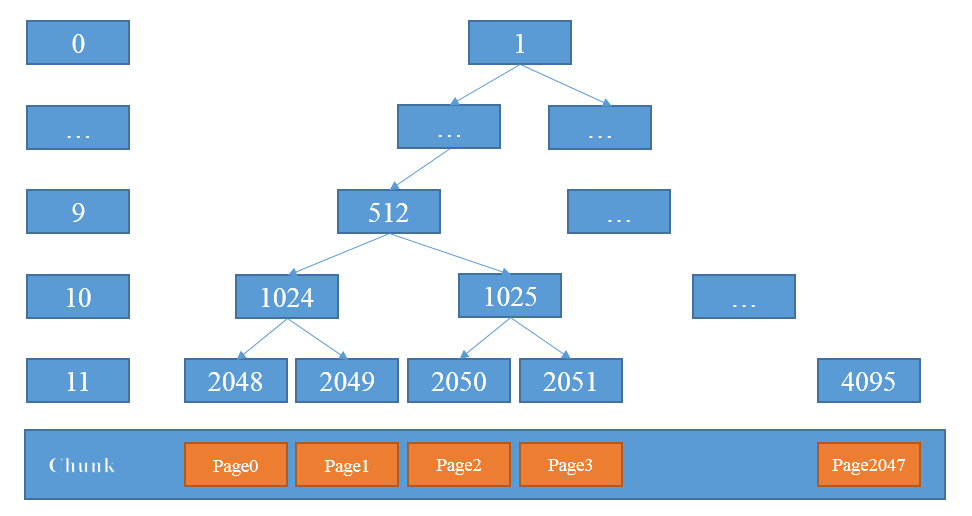

# netty内存管理

netty的内存管理是比较复杂的一个模块，需要慢慢分析才行，首先看一下 netty 内存分类的三个纬度：

1. Pooled/UnPooled 池化和非池化设计
2. byte[]/DirectByteBuffer  堆内存和直接内存
3. Unsafe/普通  采用Unsafe无锁化 和 普通处理方式


这里重点分析一下池化处理，以 PooledByteBufAllocator 为入口进行分析

在其中分别包含了两个重要属性

```java
    /**
     * Heap PoolArena 数组
     */
    private final PoolArena<byte[]>[] heapArenas;
    /**
     * Direct PoolArena 数组
     */
    private final PoolArena<ByteBuffer>[] directArenas;

```

主要关注一下 其 newHeapBuffer 方法吧

```java
    /**
     * 获得线程的 PoolThreadCache 对象
       从线程获取对应缓存的cache，避免加锁的处理
     */ 
    PoolThreadCache cache = threadCache.get();
    PoolArena<byte[]> heapArena = cache.heapArena;

    
    if (heapArena != null) {//线程缓存中有，直接从其中分配内存
            buf = heapArena.allocate(cache, initialCapacity, maxCapacity);
    // 直接创建 Heap ByteBuf 对象，基于非池化
    } else { 
        // 直接创建 Heap ByteBuf 对象，基于非池化
        buf = PlatformDependent.hasUnsafe() ?
                new UnpooledUnsafeHeapByteBuf(this, initialCapacity, maxCapacity) :
                new UnpooledHeapByteBuf(this, initialCapacity, maxCapacity);
    }
```

为了方便，主要看一下 heapArena.allocate 的方法

heapArena是一整个分配算法的核心，其核心原理是 jmalloc 算法，

```java

    PooledByteBuf<T> allocate(PoolThreadCache cache, int reqCapacity, int maxCapacity) {
        // 创建 PooledByteBuf 对象
        PooledByteBuf<T> buf = newByteBuf(maxCapacity);
        // 分配内存块给 PooledByteBuf 对象
        allocate(cache, buf, reqCapacity);
        return buf;
    }
```

其分为两个步骤：
1. 创建 PooledByteBuf 对象，注意，测试并没有真正分配内存给它
2. 分配内存块给 PooledByteBuf 对象，这个时候，才是真正把 内存分配给 它的时候。

下面分别看看两个过程

```java
    @Override
    protected PooledByteBuf<byte[]> newByteBuf(int maxCapacity) {
        return HAS_UNSAFE ? PooledUnsafeHeapByteBuf.newUnsafeInstance(maxCapacity)
                : PooledHeapByteBuf.newInstance(maxCapacity);
    }
    
    // 以 PooledHeapByteBuf 为例子
    static PooledHeapByteBuf newInstance(int maxCapacity) {
        // 从 Recycler 的对象池中获得 PooledHeapByteBuf 对象
        PooledHeapByteBuf buf = RECYCLER.get();
        // 重置 PooledDirectByteBuf 的属性
        buf.reuse(maxCapacity);
        return buf;
    }

    final void reuse(int maxCapacity) {
        // 设置最大容量
        maxCapacity(maxCapacity);
        // 设置引用数量为 0
        setRefCnt(1);
        // 重置读写索引为 0
        setIndex0(0, 0);
        // 重置读写标记位为 0
        discardMarks();
    }
```

这个并不难理解，从RECYCLER中重用一个 PooledHeapByteBuf 对象（避免频繁的new出来），设置其一些属性，例如读写指针。

接下来才是核心的 allocate 方法

```java
     // 标准化请求分配的容量, 即 3（reqCapacity） --> 4（normCapacity）； 7 --> 8
    final int normCapacity = normalizeCapacity(reqCapacity);
```

如果是分配小内存的化，是如下内容

```java
          // capacity < pageSize(默认的pageSize是 8k)
          if (isTinyOrSmall(normCapacity)) { 
            int tableIdx;
            PoolSubpage<T>[] table;
            // 判断是否为 tiny 类型的内存块申请
            boolean tiny = isTiny(normCapacity);
            if (tiny) { // < 512 tiny 类型的内存块申请
                // 从 PoolThreadCache 缓存中，分配 tiny 内存块，并初始化到 PooledByteBuf 中。
                //PoolThreadCache 其实是在线程内部保存了一系列可服用的 chunk，具体可查看PoolThreadCache
                if (cache.allocateTiny(this, buf, reqCapacity, normCapacity)) {
                    return;
                }
                // 获得 tableIdx 和 table 属性
                /**
                 * 这里的意思是这样的：
                    1. tiny 是把一个chunk分成同等大小数组的小内存
                    2. 例如 ，每一个是 1k， 取3k的化，是获取到 数组第三个元素 即 table[tableIdx]
                 */
                tableIdx = tinyIdx(normCapacity);
                table = tinySubpagePools;
            } else {
                // 从 PoolThreadCache 缓存中，分配 small 内存块，并初始化到 PooledByteBuf 中。
                if (cache.allocateSmall(this, buf, reqCapacity, normCapacity)) {
                    // was able to allocate out of the cache so move on
                    return;
                }
                // 获得 tableIdx 和 table 属性
                tableIdx = smallIdx(normCapacity);
                table = smallSubpagePools;
            }

            // 获得 PoolSubpage 链表的头节点
            final PoolSubpage<T> head = table[tableIdx];

            // 从 PoolSubpage 链表中，分配 Subpage 内存块
            synchronized (head) { // 同步 head ，避免并发问题
                final PoolSubpage<T> s = head.next;
                if (s != head) {
                    assert s.doNotDestroy && s.elemSize == normCapacity;
                    // 分配 Subpage 内存块
                    //核心，handle 其实是一个位置信息，指在此 Subpage 中哪一个数字的哪一块内容里面
                    long handle = s.allocate();
                    assert handle >= 0;
                    // 初始化 Subpage 内存块到 PooledByteBuf 对象中
                    //这里其实就是根据 handle的内容在 chunk中分配的起止位置
                    s.chunk.initBufWithSubpage(buf, handle, reqCapacity);
                    // 增加 allocationsTiny 或 allocationsSmall 计数
                    incTinySmallAllocation(tiny);
                    // 返回，因为已经分配成功
                    return;
                }
            }
            // 申请 Normal Page 内存块。实际上，只占用其中一块 Subpage 内存块。
            synchronized (this) { // 同步 arena ，避免并发问题
                allocateNormal(buf, reqCapacity, normCapacity);
            }
            // 增加 allocationsTiny 或 allocationsSmall 计数
            incTinySmallAllocation(tiny);
            // 返回，因为已经分配成功
            return;
        }
```

如果是分配大内存的话，则是如下逻辑：

```java
    if (normCapacity <= chunkSize) {
            // 从 PoolThreadCache 缓存中，分配 normal 内存块，并初始化到 PooledByteBuf 中。
            if (cache.allocateNormal(this, buf, reqCapacity, normCapacity)) {
                // was able to allocate out of the cache so move on
                return;
            }
            // 申请 Normal Page 内存块
            synchronized (this) { // 同步 arena ，避免并发问题
                allocateNormal(buf, reqCapacity, normCapacity);
                // 增加 allocationsNormal
                ++allocationsNormal;
            }
        } else {
            // 申请 Huge Page 内存块
            // Huge allocations are never served via the cache so just call allocateHuge
            allocateHuge(buf, reqCapacity);
        }
```

处理逻辑都比较复杂，下面慢慢来分析，这里首先清楚一个概念：
 1. 所有的内存都是在chunk下的，可以看看 PoolChunk的定义：
    ```java
        PoolChunk<T>{
            /**
            * 所属 Arena 对象
            */
            final PoolArena<T> arena;
            /**
            * 内存空间。
            *
            * @see PooledByteBuf#memory
            */
            final T memory;
        }
     ```
    其分为两个类型 PoolChunk<byte[]> 和 PoolChunk<ByteBuffer>,其就是 堆内存 和 直接内存；Netty自定义的ByteBuf内部其实就是包含了 一个PoolChunk,和一个对这块内存的读写指针，包含 readIndex,writeIndex, 容量等指针，限定了这个ByteBuf 在 这个 PoolChunk 上的读写范围。
2. 每次分配一个PoolChunk，PoolArea中包含了多个 PoolChunkList，然后PoolChunkList中包含了PoolChunk，PoolChunk中才包含了 PageSize(8k), 一个PoolChunk为 16M。
3. 为了快速定位 应该获取哪一个 PoolChunk，或是哪几个PoolChunk，或者是 哪一个PoolCunk中的哪一个PoolSubpage；Netty采用了一些结构，并且使用 long 类型的handle属性，将这些索引值整理成一个对象；并采用一些二叉树结构和位图结构进行了快速定位使用。

了解了以上几点，基本就能大体明白 Netty内存分配的大体逻辑了。
先从normal级别的内存分配开始

```java
     if (normCapacity <= chunkSize) {
            // 从 PoolThreadCache 缓存中，分配 normal 内存块，并初始化到 PooledByteBuf 中。
            if (cache.allocateNormal(this, buf, reqCapacity, normCapacity)) {
                // was able to allocate out of the cache so move on
                return;
            }
            // 申请 Normal Page 内存块
            synchronized (this) { // 同步 arena ，避免并发问题
                allocateNormal(buf, reqCapacity, normCapacity);
                // 增加 allocationsNormal
                ++allocationsNormal;
            }
    } 
```
可以看到，它先会从 PoolThreadCache 开始分配，由于一个 NioEventLoop 线程对应一个 PoolThreadCache，其基本是无竞争分配，非常快速；如果PoolThreadCache分配失败，则 调用 allocateNormal方法进行分配。

```java
    private void allocateNormal(PooledByteBuf<T> buf, int reqCapacity, int normCapacity) {
        // 按照优先级，从多个 ChunkList 中，分配 Normal Page 内存块。如果有一分配成功，返回
        if (q050.allocate(buf, reqCapacity, normCapacity) || q025.allocate(buf, reqCapacity, normCapacity) ||
            q000.allocate(buf, reqCapacity, normCapacity) || qInit.allocate(buf, reqCapacity, normCapacity) ||
            q075.allocate(buf, reqCapacity, normCapacity)) {
            return;
        }

        // Add a new chunk.
        // 新建 Chunk 内存块
        PoolChunk<T> c = newChunk(pageSize, maxOrder, pageShifts, chunkSize);
        // 申请对应的 Normal Page 内存块。实际上，如果申请分配的内存类型为 tiny 或 small 类型，实际申请的是 Subpage 内存块。
        long handle = c.allocate(normCapacity);
        assert handle > 0;
        // 初始化 Normal Page / Subpage 内存块到 PooledByteBuf 对象中
        c.initBuf(buf, handle, reqCapacity);
        // 添加到 ChunkList 双向链中。
        qInit.add(c);
    }
```

PoolArea中有很多个 PoolChunkList , 是采用链表连接的 PoolChunkList，可以先从里面寻找合适的 PoolChunk开始；如果分配失败，则先new一个新的Chunk出来，然后在其上进行分配;先看下new出来的Chunk,以HeapArea为例子

```java
        @Override
        protected PoolChunk<byte[]> newChunk(int pageSize, int maxOrder, int pageShifts, int chunkSize) {
            return new PoolChunk<byte[]>(this, newByteArray(chunkSize), pageSize, maxOrder, pageShifts, chunkSize, 0);
        }

        //其中 newByteArray就是 new一个java的数组
        private static byte[] newByteArray(int size) {
            return PlatformDependent.allocateUninitializedArray(size); // 创建 byte[] 数组
        }
```

接着就是在 这个chunk上分配内存了，本质上就是创建一个 ByteBuf 对象，里面包含了一个 Chunk属性（用于得到Chunk里面的数组），然后ByteBuf 设置一些指针信息（例如 readIndex/writeIndex/limit等）,表明 这个 ByteBuf 只能 访问 这个数组的这部分内容。

```java
    long allocate(int normCapacity) {
        // 大于等于 Page 大小，分配 Page 内存块
        if ((normCapacity & subpageOverflowMask) != 0) { // >= pageSize
            return allocateRun(normCapacity);
        
        } else {
            // 小于 Page 大小，分配 Subpage 内存块,后面关注
            //return allocateSubpage(normCapacity);
        }
    }

    private long allocateRun(int normCapacity) {
        // 获得跟这个normCapacity大小相称的层级
        int d = maxOrder - (log2(normCapacity) - pageShifts);
        // 获得节点
        int id = allocateNode(d);
        // 未获得到节点，直接返回
        if (id < 0) {
            return id;
        }
        // 减少剩余可用字节数
        freeBytes -= runLength(id);
        return id;
    }

    private int allocateNode(int d) {
        int id = 1;
        int initial = - (1 << d); // has last d bits = 0 and rest all = 1
        // 获得根节点的指值。
        // 如果根节点的值，大于 d ，说明，第 d 层没有符合的节点，也就是说 [0, d-1] 层也没有符合的节点。即，当前 Chunk 没有符合的节点。
        byte val = value(id);
        if (val > d) { // unusable
            return -1;
        }
        // 获得第 d 层，匹配的节点。
        // id & initial 来保证，高度小于 d 会继续循环
        while (val < d || (id & initial) == 0) { // id & initial == 1 << d for all ids at depth d, for < d it is 0
            // 进入下一层
            // 获得左节点的编号
            id <<= 1;
            // 获得左节点的值
            val = value(id);
            // 如果值大于 d ，说明，以左节点作为根节点形成虚拟的虚拟满二叉树，没有符合的节点。
            if (val > d) {
                // 获得右节点的编号
                id ^= 1;
                // 获得右节点的值
                val = value(id);
            }
        }

        // 校验获得的节点值合理
        byte value = value(id);
        assert value == d && (id & initial) == 1 << d : String.format("val = %d, id & initial = %d, d = %d",
                value, id & initial, d);

        // 更新获得的节点不可用
        setValue(id, unusable); // mark as unusable
        // 更新获得的节点的祖先都不可用
        updateParentsAlloc(id);

        // 返回节点编号
        return id;
    }
```
上面的代码相对复杂，结合图会稍微好看一点，可以看下下图 
<br> 
图来自 《自顶向下深入分析Netty（十）--JEMalloc分配算法》[https://www.jianshu.com/p/15304cd63175]

<br>可以看到，Chunk本身为 16M，每一个page为 8k，则 每一个Chunk可以划分为 2048个Page，为了表示连续的内存，Netty采用 一棵二叉树的结构，叶子节点对应每一个page，然后相邻的两个page组成 其父节点，再一次类推。

上述方法中，

```java
    int d = maxOrder - (log2(normCapacity) - pageShifts);
```
表示 当前分配的内存应该在哪一层节点分配，例如，分配 8k的内存，只能在 11层，即叶子节点层分配；如果是 32k，只能在 第9层 分配。

确定了可以分配的层数，那么就要从整棵树的根开始往下走了，例如，我要分配 8k，
1. 从根开始，假如根没被分配（代码上是 memoryDepth[0] 这个变量 没有被设置为 12-即最大层次11+1，就是说明当前层次Chunk还可用），说明这个Chunk还有空间可用；
2. 然后尝试根节点的左节点，如果发现左节点已经不可用了，则尝试右节点；
3. 依次类推，直到刚刚 “int d = maxOrder - (log2(normCapacity) - pageShifts);” 计算出来的这个d的层次。
4. 如果可以分配，则当前分配的节点不可用，然后依次设置当前节点的父亲及其以上的节点，表示其只能分配剩下大小的内存了，例如： 在 11层（最后一层的第一个节点分配了一个Page，则当前节点设置为不可用；其父节点不能在分配16k了，只能分配另一个 8k-设置方式是将 子节点的层次值 赋值给父亲节点即可）


经过以上步骤，即可定位 一个指定大小的ByteBuf应该分配到 一整块内存的那个位置了（其采用一个handle长整型数据来表示，这个handle说白了，就是将 上述 chunk的树的id记录一下，然后真正分配内存的时候，转换成 byte[]数组的一个下标值，表示这个 ByteBuf 只能访问 这一整块内存 的哪个地方）

```java
    // 初始化 Normal Page / Subpage 内存块到 PooledByteBuf 对象中
    c.initBuf(buf, handle, reqCapacity);

    void initBuf(PooledByteBuf<T> buf, long handle, int reqCapacity) {
        // 获得 memoryMap 数组的编号( 下标 )
        int memoryMapIdx = memoryMapIdx(handle);
        // 获得 bitmap 数组的编号( 下标 )。注意，此时获得的还不是真正的 bitmapIdx 值，需要经过 `bitmapIdx & 0x3FFFFFFF` 运算。
        int bitmapIdx = bitmapIdx(handle);
        if (bitmapIdx == 0) {// 内存块为 Page
            byte val = value(memoryMapIdx);
            assert val == unusable : String.valueOf(val);
            // 初始化 Page 内存块到 PooledByteBuf 中
            buf.init(this, handle, runOffset(memoryMapIdx) + offset, reqCapacity, runLength(memoryMapIdx), arena.parent.threadCache());
        
        } else {// 内存块为 SubPage
            // 初始化 Subpage 内存块到 PooledByteBuf 中
            initBufWithSubpage(buf, handle, bitmapIdx, reqCapacity);
        }
    }
```
如此以来，一个Chunk的分配即可完成。

值得说明的是，分配内存返回的，

对应的chunk的释放：
```java

    void free(long handle) {
        // 获得 memoryMap 数组的编号( 下标 )
        int memoryMapIdx = memoryMapIdx(handle);
        // 获得 bitmap 数组的编号( 下标 )。注意，此时获得的还不是真正的 bitmapIdx 值，需要经过 `bitmapIdx & 0x3FFFFFFF` 运算。
        int bitmapIdx = bitmapIdx(handle);

        // 释放 Subpage begin ~

        if (bitmapIdx != 0) { // free a subpage bitmapIdx 非空，说明释放的是 Subpage
            // 获得 PoolSubpage 对象
            PoolSubpage<T> subpage = subpages[subpageIdx(memoryMapIdx)];
            assert subpage != null && subpage.doNotDestroy;

            // 获得对应内存规格的 Subpage 双向链表的 head 节点
            // Obtain the head of the PoolSubPage pool that is owned by the PoolArena and synchronize on it.
            // This is need as we may add it back and so alter the linked-list structure.
            PoolSubpage<T> head = arena.findSubpagePoolHead(subpage.elemSize);
            // 加锁，分配过程会修改双向链表的结构，会存在多线程的情况。
            synchronized (head) {
                // 释放 Subpage 。
                if (subpage.free(head, bitmapIdx & 0x3FFFFFFF)) {
                    return;
                }
                // ↑↑↑ 返回 false ，说明 Page 中无切分正在使用的 Subpage 内存块，所以可以继续向下执行，释放 Page
            }
        }

        // 释放 Page begin ~

        // 增加剩余可用字节数
        freeBytes += runLength(memoryMapIdx);
        // 设置 Page 对应的节点可用
        setValue(memoryMapIdx, depth(memoryMapIdx));
        // 更新 Page 对应的节点的祖先可用
        updateParentsFree(memoryMapIdx);
    }
```

ByteBuf使用完之后的使用，也是传入handle，根据handle计算对应的位置，如果是 Subpage，会经过一系列分析，后续分析，如果是Chunk中的page的话，则直接将Page对应的节点设置为可用，然后更新其父节点即可。


下面来看下 Huge Page的分配

```java
    PoolArea:
    // 申请 Huge Page 内存块
    allocateHuge(buf, reqCapacity);

    private void allocateHuge(PooledByteBuf<T> buf, int reqCapacity) {
        // 新建 Chunk 内存块，它是 unpooled 的
        PoolChunk<T> chunk = newUnpooledChunk(reqCapacity);
        // 增加 activeBytesHuge
        activeBytesHuge.add(chunk.chunkSize());
        // 初始化 Huge 内存块到 PooledByteBuf 对象中
        buf.initUnpooled(chunk, reqCapacity);
        // 增加 allocationsHuge
        allocationsHuge.increment();
    }
```
注释上已经说明清楚了，Huge的不会在 Pool上分配，而是直接在 Unpool上进行分配，释放的话，也是直接进行释放，不会重复利用。

```java

void free(PoolChunk<T> chunk, long handle, int normCapacity, PoolThreadCache cache) {
    if (chunk.unpooled) {
        int size = chunk.chunkSize();
        // 直接销毁 Chunk 内存块，因为占用空间较大
        destroyChunk(chunk);
        // 减少 activeBytesHuge 计数
        activeBytesHuge.add(-size);
        // 减少 deallocationsHuge 计数
        deallocationsHuge.increment();
    }
}
```


接下来对 Subpage的分配和释放进行分析。


