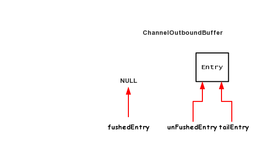
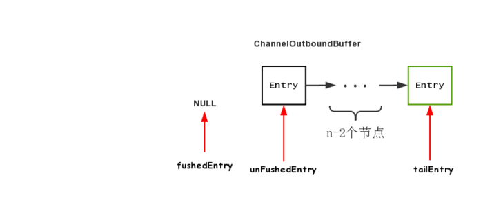
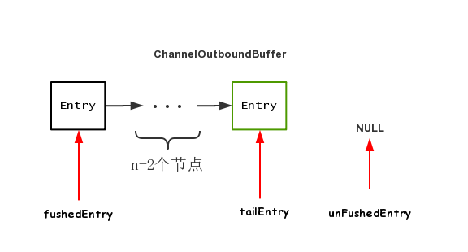

## Netty4 写

本文主要描述一下 netty4的写流程，netty的写分为两个主要流程：
- write 将数据写入netty的缓存
- flush 将netty缓存的数据刷入到对端

声明：下文的图示来自 闪电侠《netty源码分析之writeAndFlush全解析》[https://www.jianshu.com/p/feaeaab2ce56]


### write
  
  一般来说，使用Netty的write方法有如下几种方式
  1. channel.write();
  2. pipeline.write();
  3. ctx.write()

   第一种和第二种是类似的，channel.write内部也会调用到pipeline.write方法，1/2和3的区别是：
   - pipeline.write会从pipeline最后的节点（即TailContext）开始往前传播,ChannelOutboundHandler，最终到达HeadContext
   - ctx.write 会从当前的ChannelHandlerContext开始往前传播，最终到达HeadContext.
  
   先看一下 AbstractChannelHandlerContext 的write方法，因为不管是 ctx.write，还是pipeine.write，都会调用到AbstractChannelHandlerContext.write方法。（pipeine.write也是从TailContext开始，TailContext继承自AbstractChannelHandlerContext）

   ```java
    EventExecutor executor = next.executor();
        // 在 EventLoop 的线程中
        if (executor.inEventLoop()) {
            // 执行 writeAndFlush 事件到下一个节点
            if (flush) {
                next.invokeWriteAndFlush(m, promise);
            // 执行 write 事件到下一个节点
            } else {
                next.invokeWrite(m, promise);
            }
        } else {
            AbstractWriteTask task;
            // 创建 writeAndFlush 任务
            if (flush) {
                task = WriteAndFlushTask.newInstance(next, m, promise);
            // 创建 write 任务
            }  else {
                task = WriteTask.newInstance(next, m, promise);
            }
            // 提交到 EventLoop 的线程中，执行该任务
            safeExecute(executor, task, promise, m);
        }
   ```

   从中可以看到Netty的处理，如果不在Netty的EventLoop线程中的话，会创建一个Task（要么是Write任务，要么是WriteAndFlushTask任务，扔到EventLoop的队列中，让下一次EventLoop轮训处理）。
   
   什么情况下会在 if的情况，什么情况下会是创建任务的情况呢？
   - 一般在channelRead等方法中直接write的就是if 的情况。
   - 一般在用户自定义线程池，或者另外起了一个EventGroup的情况下，则会是创建任务的情况。


   为什么会到达HeadContext呢？因为HeadContext中包含了unsafe属性，专门用于处理jdk网络相关的读写的。

    下面来看一下 unsafe.write.
    其主要为 AbstractUnsafe.write方法

```java

    /**
    * 内存队列
    */
    private volatile ChannelOutboundBuffer outboundBuffer = new ChannelOutboundBuffer(AbstractChannel.this);

        @Override
        public final void write(Object msg, ChannelPromise promise) {
            assertEventLoop();

            ChannelOutboundBuffer outboundBuffer = this.outboundBuffer;
            // 内存队列为空
            if (outboundBuffer == null) {
                // 内存队列为空，一般是 Channel 已经关闭，所以通知 Promise 异常结果
                safeSetFailure(promise, WRITE_CLOSED_CHANNEL_EXCEPTION);
                // 释放消息( 对象 )相关的资源
                // release message now to prevent resource-leak
                ReferenceCountUtil.release(msg);
                return;
            }

            int size;
            try {
                // 过滤写入的消息( 数据 )
                msg = filterOutboundMessage(msg);
                // 计算消息的长度
                size = pipeline.estimatorHandle().size(msg);
                if (size < 0) {
                    size = 0;
                }
            } catch (Throwable t) {
                // 通知 Promise 异常结果
                safeSetFailure(promise, t);
                // 释放消息( 对象 )相关的资源
                ReferenceCountUtil.release(msg);
                return;
            }

            // 写入消息( 数据 )到内存队列
            outboundBuffer.addMessage(msg, size, promise);
        }
```

其中 filterOutboundMessage(msg) 是将 堆字节数组转为 直接内存数组

```java
    @Override
    protected final Object filterOutboundMessage(Object msg) {
        // ByteBuf 的情况
        if (msg instanceof ByteBuf) {
            ByteBuf buf = (ByteBuf) msg;
            // 已经是 Direct ByteBuf
            if (buf.isDirect()) {
                return msg;
            }

            // 非 Direct ByteBuf ，需要进行创建封装
            return newDirectBuffer(buf);
        }

        // FileRegion 的情况
        if (msg instanceof FileRegion) {
            return msg;
        }

        // 不支持其他类型
        throw new UnsupportedOperationException("unsupported message type: " + StringUtil.simpleClassName(msg) + EXPECTED_TYPES);
    }
```

最后，调用 ChannelOutboundBuffer.addMessage(msg, size, promise) 方法，写入消息( 数据 )到内存队列。
关于ChannelOutboundBuffer,再flush部分来说明。

最后简单说明一下 Write和WriteAndFlush任务的区别

- Write任务只是讲数据写入到Netty的内存队列，无需wakeup EventLoop线程
- WriteAndFlush 会wakeup EventLoop 线程

实现的原理在于 虽然WriteTask和WriteAndFlushTask都继承自了AbstractWriteTask，但是WriteTask还实现了SingleThreadEventLoop.NonWakeupRunnable接口。

这个接口的使用是在 SingleThreadEventExecutor（EventLoop轮训的真正执行者）的execute方法中

```java

  @Override
    public void execute(Runnable task) {
        ....
        // 唤醒线程
        if (!addTaskWakesUp && wakesUpForTask(task)) {
            wakeup(inEventLoop);
        }
    }

    @Override
    protected boolean wakesUpForTask(Runnable task) {
        return !(task instanceof NonWakeupRunnable);
    }

```


### flush

flush是将缓存的数据刷到对端，核心为AbstractUnsafe的flush方法

```java
        @Override
        public final void flush() {
            assertEventLoop();

            // 内存队列为 null ，一般是 Channel 已经关闭，所以直接返回。
            ChannelOutboundBuffer outboundBuffer = this.outboundBuffer;
            if (outboundBuffer == null) {
                return;
            }

            // 标记内存队列开始 flush
            outboundBuffer.addFlush();
            // 执行 flush
            flush0();
        }
```

核心是最后两句，先看第一个，ChannelOutboundBuffer.addFlush() 方法，标记内存队列开始 flush.

ChannelOutboundBuffer是Netty的内存队列，在 write 操作时，将数据写到 ChannelOutboundBuffer 中，都会产生一个 Entry 对象。
Entry的数据结构定义如下：

```java
        static final class Entry {
        /**
         * 下一条 Entry
         */
        Entry next;
        /**
         * 消息（数据）
         */
        Object msg;
        /**
         * {@link #msg} 转化的 NIO ByteBuffer 数组
         */
        ByteBuffer[] bufs;
        /**
         * {@link #msg} 转化的 NIO ByteBuffer 对象
         */
        ByteBuffer buf;
        /**
         * Promise 对象
         */
        ChannelPromise promise;
        /**
         * 已写入的字节数
         */
        long progress;
        /**
         * 长度，可读字节数数。
         */
        long total;
        /**
         * 每个 Entry 预计占用的内存大小，计算方式为消息( {@link #msg} )的字节数 + Entry 对象自身占用内存的大小。
         */
        int pendingSize;
        /**
         * {@link #msg} 转化的 NIO ByteBuffer 的数量。
         *
         * 当 = 1 时，使用 {@link #buf}
         * 当 > 1 时，使用 {@link #bufs}
         */
        int count = -1;
        /**
         * 是否取消写入对端
         */
        boolean cancelled;
    }
```

而ChannelOutboundBuffer的类中几个核心的属性如下：

```java
    class ChannelOutboundBuffer{
        /**
     * 第一个( 开始 ) flush Entry
     */
    // The Entry that is the first in the linked-list structure that was flushed
    private Entry flushedEntry;
    /**
     * 第一个未 flush Entry
     */
    // The Entry which is the first unflushed in the linked-list structure
    private Entry unflushedEntry;
    /**
     * 尾 Entry
     */
    // The Entry which represents the tail of the buffer
    private Entry tailEntry;
    }
```

在unsafe.write方法是 ChannelOutboundBuffer调用的是addMessage方法，大体如下

```java
        public void addMessage(Object msg, int size, ChannelPromise promise) {
        // 创建新 Entry 对象
        Entry entry = Entry.newInstance(msg, size, total(msg), promise);
        // 若 tailEntry 为空，将 flushedEntry 也设置为空。防御型编程，实际不会出现
        if (tailEntry == null) {
            flushedEntry = null;
        // 若 tailEntry 非空，将原 tailEntry 指向新 Entry
        } else {
            Entry tail = tailEntry;
            tail.next = entry;
        }
        // 更新 tailEntry 为新 Entry
        tailEntry = entry;
        // 若 unflushedEntry 为空，更新为新 Entry
        if (unflushedEntry == null) {
            unflushedEntry = entry;
        }

        // 增加 totalPendingSize 计数
        // increment pending bytes after adding message to the unflushed arrays.
        // See https://github.com/netty/netty/issues/1619
        incrementPendingOutboundBytes(entry.pendingSize, false);
    }
```

此时会填充 unflushedEntry和tailEntry两个指针，基本如下图所示

<br>

<br>


而outboundBuffer.addFlush()则是开始移动flushedEntry，unflushedEntry和tailEntry三个指针，表示开始flush 的数据。

```java
        Entry entry = unflushedEntry;
        if (entry != null) {
            // 若 flushedEntry 为空，赋值为 unflushedEntry ，用于记录第一个( 开始 ) flush 的 Entry 。
            if (flushedEntry == null) {
                // there is no flushedEntry yet, so start with the entry
                flushedEntry = entry;
            }
            // 计算 flush 的数量，并设置每个 Entry 对应的 Promise 不可取消
            do {
                // 增加 flushed
                flushed ++;
                // 设置 Promise 不可取消
                if (!entry.promise.setUncancellable()) { // 设置失败
                    // 减少 totalPending 计数
                    // Was cancelled so make sure we free up memory and notify about the freed bytes
                    int pending = entry.cancel();
                    decrementPendingOutboundBytes(pending, false, true);
                }
                // 获得下一个 Entry
                entry = entry.next;
            } while (entry != null);

            // 设置 unflushedEntry 为空，表示所有都 flush
            // All flushed so reset unflushedEntry
            unflushedEntry = null;
        }
```

用图示表示即是<br>：
<br>


outboundBuffer还有一个比较重要的方法：nioBuffers。

```java

    public ByteBuffer[] nioBuffers(int maxCount, long maxBytes) {
        assert maxCount > 0;
        assert maxBytes > 0;
        long nioBufferSize = 0;
        int nioBufferCount = 0;
        // 获得当前线程的 NIO ByteBuffer 数组缓存。
        final InternalThreadLocalMap threadLocalMap = InternalThreadLocalMap.get();
        ByteBuffer[] nioBuffers = NIO_BUFFERS.get(threadLocalMap);
        // 从 flushedEntry 节点，开始向下遍历
        Entry entry = flushedEntry;
        while (isFlushedEntry(entry) && entry.msg instanceof ByteBuf) {
            // 若 Entry 节点已经取消，忽略。
            if (!entry.cancelled) {
                ByteBuf buf = (ByteBuf) entry.msg;
                // 获得消息( 数据 )开始读取位置
                final int readerIndex = buf.readerIndex();
                // 获得消息( 数据 )可读取的字节数
                final int readableBytes = buf.writerIndex() - readerIndex;

                // 若无可读取的数据，忽略。
                if (readableBytes > 0) {
                    // 前半段，可读取的字节数，不能超过 maxBytes
                    // 后半段，如果第一条数据，就已经超过 maxBytes ，那么只能“强行”读取，否则会出现一直无法读取的情况。
                    if (maxBytes - readableBytes < nioBufferSize && nioBufferCount != 0) {
                        break;
                    }
                    // 增加 nioBufferSize
                    nioBufferSize += readableBytes;
                    // 初始 Entry 节点的 NIO ByteBuffer 数量
                    int count = entry.count;
                    if (count == -1) {
                        //noinspection ConstantValueVariableUse
                        entry.count = count = buf.nioBufferCount();
                    }
                    // 如果超过 NIO ByteBuffer 数组的大小，进行扩容。
                    int neededSpace = min(maxCount, nioBufferCount + count);
                    if (neededSpace > nioBuffers.length) {
                        nioBuffers = expandNioBufferArray(nioBuffers, neededSpace, nioBufferCount);
                        NIO_BUFFERS.set(threadLocalMap, nioBuffers);
                    }
                    // 初始化 Entry 节点的 buf / bufs 属性
                    if (count == 1) {
                        ByteBuffer nioBuf = entry.buf;
                        if (nioBuf == null) {
                            // cache ByteBuffer as it may need to create a new ByteBuffer instance if its a
                            // derived buffer
                            entry.buf = nioBuf = buf.internalNioBuffer(readerIndex, readableBytes);
                        }
                        nioBuffers[nioBufferCount++] = nioBuf;
                    } else {
                        ByteBuffer[] nioBufs = entry.bufs;
                        if (nioBufs == null) {
                            // cached ByteBuffers as they may be expensive to create in terms
                            // of Object allocation
                            entry.bufs = nioBufs = buf.nioBuffers();
                        }
                        for (int i = 0; i < nioBufs.length && nioBufferCount < maxCount; ++i) {
                            ByteBuffer nioBuf = nioBufs[i];
                            if (nioBuf == null) {
                                break;
                            } else if (!nioBuf.hasRemaining()) {
                                continue;
                            }
                            nioBuffers[nioBufferCount++] = nioBuf;
                        }
                    }

                    // 到达 maxCount 上限，结束循环。老艿艿的想法，这里最好改成 nioBufferCount >= maxCount ，是有可能会超过的
                    if (nioBufferCount == maxCount) {
                        break;
                    }
                }
            }

            // 下一个 Entry节点
            entry = entry.next;
        }

        // 设置 nioBufferCount 和 nioBufferSize 属性
        this.nioBufferCount = nioBufferCount;
        this.nioBufferSize = nioBufferSize;

        return nioBuffers;
    }

```
总体来说，就是获取一次可以写到对端的最大数据。<br>


看完了outboundBuffer的相关内容，再回头看看unsafe.flush0方法

```java
    @Override
    protected final void flush0() {
        // Flush immediately only when there's no pending flush.
        // If there's a pending flush operation, event loop will call forceFlush() later,
        // and thus there's no need to call it now.
        if (!isFlushPending()) {
            super.flush0();
        }
    }

    private boolean isFlushPending() {
        SelectionKey selectionKey = selectionKey();
        return selectionKey.isValid() // 合法
                && (selectionKey.interestOps() & SelectionKey.OP_WRITE) != 0; // 对 SelectionKey.OP_WRITE 事件不感兴趣。
    }
```

flush0最终会调用父类的flush方法，再此之前主要先调用isFlushPending做下判断：

    如果处于对 SelectionKey.OP_WRITE 事件感兴趣，说明 Channel 此时是不可写的，那么调用父类 AbstractUnsafe 的 #flush0() 方法，也没有意义，所以就不调用。

因为注册 SelectionKey.OP_WRITE，是在写入数据到对端失败的时候，所以判断到有注册这个事件，表明当前不可写，所以暂时不要去写数据了。

flush0最终调用的是 NioSocketChannel.doWrite(outboundBuffer)方法

```java
     @Override
    protected void doWrite(ChannelOutboundBuffer in) throws Exception {
        SocketChannel ch = javaChannel();
        // 获得自旋写入次数
        int writeSpinCount = config().getWriteSpinCount();
        do {
            // 内存队列为空，结束循环，直接返回
            if (in.isEmpty()) {
                // 取消对 SelectionKey.OP_WRITE 的感兴趣
                clearOpWrite();
                // Directly return here so incompleteWrite(...) is not called.
                return;
            }

            // 获得每次写入的最大字节数
            // Ensure the pending writes are made of ByteBufs only.
            int maxBytesPerGatheringWrite = ((NioSocketChannelConfig) config).getMaxBytesPerGatheringWrite();
            // 从内存队列中，获得要写入的 ByteBuffer 数组
            ByteBuffer[] nioBuffers = in.nioBuffers(1024, maxBytesPerGatheringWrite);
            // 写入的 ByteBuffer 数组的个数
            int nioBufferCnt = in.nioBufferCount();

            // 写入 ByteBuffer 数组，到对端
            switch (nioBufferCnt) {
                case 0:
                    //写入文件
                    // We have something else beside ByteBuffers to write so fallback to normal writes.
                    writeSpinCount -= doWrite0(in);
                    break;
                case 1: {
                    //写入一个ByteBuffer
                    // Only one ByteBuf so use non-gathering write
                    // Zero length buffers are not added to nioBuffers by ChannelOutboundBuffer, so there is no need
                    // to check if the total size of all the buffers is non-zero.
                    ByteBuffer buffer = nioBuffers[0];
                    int attemptedBytes = buffer.remaining();
                    // 执行 NIO write 调用，写入单个 ByteBuffer 对象到对端
                    final int localWrittenBytes = ch.write(buffer);
                    // 写入字节小于等于 0 ，说明 NIO Channel 不可写，所以注册 SelectionKey.OP_WRITE ，等待 NIO Channel 可写，并返回以结束循环
                    if (localWrittenBytes <= 0) {
                        incompleteWrite(true);
                        return;
                    }
                    // TODO 芋艿 调整每次写入的最大字节数
                    adjustMaxBytesPerGatheringWrite(attemptedBytes, localWrittenBytes, maxBytesPerGatheringWrite);
                    // 从内存队列中，移除已经写入的数据( 消息 )
                    in.removeBytes(localWrittenBytes);
                    // 写入次数减一
                    --writeSpinCount;
                    break;
                }
                //写入多个ByteBuffer
                default: {
                    long attemptedBytes = in.nioBufferSize();
                    // 执行 NIO write 调用，写入多个 ByteBuffer 到对端
                    final long localWrittenBytes = ch.write(nioBuffers, 0, nioBufferCnt);
                    // 写入字节小于等于 0 ，说明 NIO Channel 不可写，所以注册 SelectionKey.OP_WRITE ，等待 NIO Channel 可写，并返回以结束循环
                    if (localWrittenBytes <= 0) {
                        incompleteWrite(true);
                        return;
                    }
                    //调整每次写入的最大字节数(根据上次写的情况调整本次的写字节数)
                    adjustMaxBytesPerGatheringWrite((int) attemptedBytes, (int) localWrittenBytes, maxBytesPerGatheringWrite);
                    // 从内存队列中，移除已经写入的数据( 消息 )
                    in.removeBytes(localWrittenBytes);
                    // 写入次数减一
                    --writeSpinCount;
                    break;
                }
            }
        } while (writeSpinCount > 0); // 循环自旋写入

        // 内存队列中的数据未完全写入，说明 NIO Channel 不可写，所以注册 SelectionKey.OP_WRITE ，等待 NIO Channel 可写
        incompleteWrite(writeSpinCount < 0);
    }
```

Channel 不可写的时候，会注册 SelectionKey.OP_WRITE ，等待 NIO Channel 可写。而后会”回调” forceFlush() 方法。

其中，
```java
    // 执行 NIO write 调用，写入单个 ByteBuffer 对象到对端
    final int localWrittenBytes = ch.write(buffer);
    // 写入字节小于等于 0 ，说明 NIO Channel 不可写，所以注册 SelectionKey.OP_WRITE ，等待 NIO Channel 可写，并返回以结束循环
    if (localWrittenBytes <= 0) {
        incompleteWrite(true);
        return;
    }

    protected final void incompleteWrite(boolean setOpWrite) {
    // true ，注册对 SelectionKey.OP_WRITE 事件感兴趣
    if (setOpWrite) {
        setOpWrite();
    // false ，取消对 SelectionKey.OP_WRITE 事件感兴趣
    } else {
        clearOpWrite();

        // Schedule flush again later so other tasks can be picked up in the meantime
        // 立即发起下一次 flush 任务
        eventLoop().execute(flushTask); // <1>
    }
}
```
<br>

回到 NioEventLoop 部分，在写入到 Channel 到对端，若 TCP 数据发送缓冲区已满，这将导致 Channel 不写可，此时会注册对该 Channel 的 SelectionKey.OP_WRITE 事件感兴趣。从而实现，再在 Channel 可写后，进行强制 flush 。
```java
// OP_WRITE 事件就绪
// Process OP_WRITE first as we may be able to write some queued buffers and so free memory.

processSelectedKey(){
    if ((readyOps & SelectionKey.OP_WRITE) != 0) {
        // Call forceFlush which will also take care of clear the OP_WRITE once there is nothing left to write
        // 向 Channel 写入数据
        ch.unsafe().forceFlush();
    }
}

@Override
public final void forceFlush() {
    // directly call super.flush0() to force a flush now
    super.flush0();
}

```


另外，当我们不断调用 #addMessage(Object msg, int size, ChannelPromise promise) 方法，添加消息到 ChannelOutboundBuffer 内存队列中，如果不及时 flush 写到对端( 例如程序一直未调用 Channel#flush() 方法，或者对端接收数据比较慢导致 Channel 不可写 )，可能会导致 OOM 内存溢出。所以，在 ChannelOutboundBuffer 使用 totalPendingSize 属性，存储所有 Entry 预计占用的内存大小( pendingSize )。

- 在 totalPendingSize 大于高水位阀值时( ChannelConfig.writeBufferHighWaterMark ，默认值为 64 KB )，关闭写开关( unwritable )。
- 在 totalPendingSize 小于低水位阀值时( ChannelConfig.writeBufferLowWaterMark ，默认值为 32 KB )，打开写开关( unwritable )。

代码如下：

```java
      void incrementPendingOutboundBytes(long size) {
        incrementPendingOutboundBytes(size, true);
    }

    private void incrementPendingOutboundBytes(long size, boolean invokeLater) {
        if (size == 0) {
            return;
        }

        // 增加 totalPendingSize 计数
        long newWriteBufferSize = TOTAL_PENDING_SIZE_UPDATER.addAndGet(this, size);
        // totalPendingSize 大于高水位阀值时，设置为不可写
        if (newWriteBufferSize > channel.config().getWriteBufferHighWaterMark()) {
            setUnwritable(invokeLater);
        }
    }

        void decrementPendingOutboundBytes(long size) {
        decrementPendingOutboundBytes(size, true, true);
    }

    private void decrementPendingOutboundBytes(long size, boolean invokeLater, boolean notifyWritability) {
        if (size == 0) {
            return;
        }

        // 减少 totalPendingSize 计数
        long newWriteBufferSize = TOTAL_PENDING_SIZE_UPDATER.addAndGet(this, -size);
        // totalPendingSize 小于低水位阀值时，设置为可写
        if (notifyWritability && newWriteBufferSize < channel.config().getWriteBufferLowWaterMark()) {
            setWritable(invokeLater);
        }
    }

    private void setUnwritable(boolean invokeLater) {
        for (;;) {
            final int oldValue = unwritable;
            // 或位操作，修改第 0 位 bits 为 1
            final int newValue = oldValue | 1;
            // CAS 设置 unwritable 为新值
            if (UNWRITABLE_UPDATER.compareAndSet(this, oldValue, newValue)) {
                // 若之前可写，现在不可写，触发 Channel WritabilityChanged 事件到 pipeline 中。
                if (oldValue == 0 && newValue != 0) {
                    fireChannelWritabilityChanged(invokeLater);
                }
                break;
            }
        }
    }
```
通过 Channel WritabilityChanged 事件，配合 io.netty.handler.stream.ChunkedWriteHandler 处理器，实现 ChannelOutboundBuffer 写入的控制，避免 OOM 。（ChunkedWriteHandler会有 isWritable的判断）

```java
    public boolean isWritable() {
        return unwritable == 0;
    }
```
