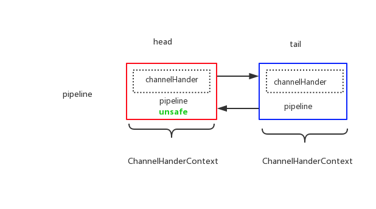

##Netty Pipeline

在深入netty读写之前，先来看一下pipeline设计。

参考自 闪电侠《netty源码分析之pipeline》[https://www.jianshu.com/p/6efa9c5fa702]

Netty pipeline是一种责任链的设计模式，通过 全局Context包装每一个handler，让其组合形成可以工作的处理单元，每一个handler做一个逻辑处理，例如：TCP拆包处理，业务编解码等。

首先看下代码，pipeline的创建位置：

```java
        protected AbstractChannel(Channel parent) {
        this.parent = parent;
        // 创建 ChannelId 对象
        id = newId();
        // 创建 Unsafe 对象
        unsafe = newUnsafe();
        // 创建 DefaultChannelPipeline 对象
        pipeline = newChannelPipeline();
    }
```

可以看出，一个Channel对应一个pipeline，一个pipeline处理一个Channel上的数据流。<br>
pipeline中的每个节点是一个ChannelHandlerContext对象，每个context节点保存了它包裹的执行器 ChannelHandler执行操作所需要的上下文，其实就是pipeline，因为pipeline包含了channel的引用，可以拿到所有的context信息。<br>

如果没有添加任何的处理handler，则最原始的pipeline上存在的两个handler时head和tail，如下图所示:<br>


其实只要理解了head和tail，就基本能理解pipeline的处理流向了。我们可以看到在head上有一个 unsafe 的属性对象。在Netty中，跟jdk底层网络相关的处理，就会用到这个unsafe对象。
因此我们可以得出这样的结论：
 - 从网络端流入到应用，是从head到tail的流向，中间经历过各种handler的处理，从网络数据转为业务数据
 - 从应用流向网络，是从tail流向head（不一定从tail节点开始，可能从用户自定义handler开始），中间经历各种handler处理，从业务数据转为网络数据

<br>

pipeline内部对节点的组织是采用双向链表的方式的，有前驱节点（prev）和后驱节点（next），便于删除和添加。
<br>
在pipeline节点上，又分为inBound节点和outBound节点，inBound节点是处理从网络进来的数据的，outBound节点是处理从业务到网络的数据的。
基本类似于 Netty 3 中的Upstream和Downstream，区别在于，Netty3中的upstream是在I/O线程里执行的，而downstream是在业务线程里执行；而Netty4中 inBound节点和outBound 都是在 IO线程（NioEventLoop）中执行，如果不是IO线程，则通过任务封装提交到IO线程处理。


下面来看下在pipeline业务处理中，是如何根据进出来查找对应的inBound和OutBound节点的。

首先是对inBound和outBound的判断

```java
private static boolean isInbound(ChannelHandler handler) { 
    return handler instanceof ChannelInboundHandler; 
} 

private static boolean isOutbound(ChannelHandler handler) { 
    return handler instanceof ChannelOutboundHandler; 
}
```

在查找pipeline过程中，会不断从head到tail或是从tail到head判断每一个节点是InBound还是OutBound，找到了则拿出来从其中获取handler来处理数据。


最后，我们来看一个问题，一般如果要写数据到网络的话，会有两种方式：<br>
1. ctx.write
2. pipeline.write
<br>

第一种是 数据从当前节点往head流，不会走到当前节点往后的节点了。<br>
第二种是 从tail往head流，会走完pipeline中的所有OutBound节点。
<br>

Pipeline大体分析到此为止。


