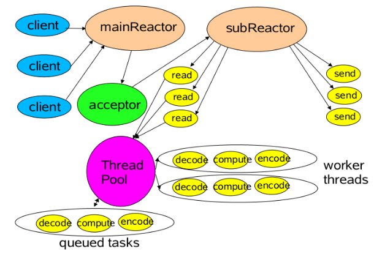

##Netty服务端端口绑定

任意一个服务器启动，都需要绑定一个服务器机器上的一个端口，我们来看一下Netty中如何简单的启动服务端程序的。


我们需要关注一下几个问题：
 - 如何启动EventLoop线程
 - 如何注册 ACCEPT 事件
 - 如何绑定服务端端口


先来看一下完整的代码 <br>
```java
    EventLoopGroup bossGroup = new NioEventLoopGroup(1); 
    EventLoopGroup workerGroup = new NioEventLoopGroup();
    ServerBootstrap b = new ServerBootstrap();
    b.group(bossGroup, workerGroup) 
     .channel(NioServerSocketChannel.class)
    b.bind(8080).addListener(new ChannelFutureListener() {
                @Override
                public void operationComplete(ChannelFuture future) throws Exception {
                    System.out.println("测试下被触发");
                }
        }).sync();
```


首先来看头两句<br>
```java
    // 创建 boss 线程组 用于服务端接受客户端的连接
    EventLoopGroup bossGroup = new NioEventLoopGroup(1); 
    // 创建 worker 线程组 用于进行 SocketChannel 的数据读写
    EventLoopGroup workerGroup = new NioEventLoopGroup();
```

Netty 内部采用的是 Reactor 模型，服务端主流的用法是 主从Reactor多线程模型，大体框架如下图所示<br>

<br>

对应上述代码，bossGroup主要是用于接受客户端连接（Accept），然后把 连接通道（Channel）分发给 workerGroup组来负责读写（write/read）。 
值得说明的是，Netty的readtor线程核心在 NioEventLoopGroup 和 NioEventLoop，接受连接和处理读写都在其中，这个后面会进行分析。

<br>

```java
 // 创建 ServerBootstrap 对象
 ServerBootstrap b = new ServerBootstrap();
 // 设置使用的 EventLoopGroup
 b.group(bossGroup, workerGroup) 
  // 设置要被实例化的为 NioServerSocketChannel 类
  .channel(NioServerSocketChannel.class)
```
<br>
这里主要是创建一个 ServerBootstrap 类，然后设置一些属性，以便内部的处理。
<br>

```java
   //启动服务器，绑定 8080端口
   b.bind(8080)
```
这一句才是核心，后面的addListener和sync是绑定成功的回调处理和等待绑定完成。下面我们跟入这个方法看看处理的流程。<br>

```java
    public ChannelFuture bind(int inetPort) {
        return bind(new InetSocketAddress(inetPort));
    }
```
<br>
一直跟下去，最终调用到到的是AbstractBootstrap.doBind方法：<br>
下面一步步看看doBind方法中每一个步骤

- 初始化并注册 Channel
```java
   // 初始化并注册一个 Channel 对象，因为注册是异步的过程，所以返回一个 ChannelFuture 对象。
    final ChannelFuture regFuture = initAndRegister(); 
```
<br>
先来看一下 initAndRegister的核心方法

```java
  （AbstractBootstrap）final ChannelFuture initAndRegister() {
         // 创建 Channel 对象
         channel = channelFactory.newChannel();
         // 初始化 Channel 配置
         init(channel);
         // 注册 Channel 到 EventLoopGroup 中
         ChannelFuture regFuture = config().group().register(channel);
         //返回 凭证，在外部判断是否已经初始化完成
         return regFuture;
  }
```
<br>
  - 创建 Channel 对象<br>
 
  ```java
     channel = channelFactory.newChannel();
  ```
  <br>
  采用工厂模式，利用反射的方式创建，创建出来得channel是我们设置的 NioServerSocketChannel
  <br>

  ```java
    (ServerBootstrap)b.channel(NioServerSocketChannel.class)
  ```

  <br>
  来看一下 NioServerSocketChannel 的初始,为了更好的看清，我把父类构造的也一起放到该构造函数下了。
  <br>

```java
    public NioServerSocketChannel(ServerSocketChannel channel) {
        this.parent = parent;
        // 创建 ChannelId 对象
        id = newId();
        // 创建 Unsafe 对象
        unsafe = newUnsafe();
        // 创建 DefaultChannelPipeline 对象
        pipeline = newChannelPipeline();
        //ch是 JDK的 ServerSocketChannel
        this.ch = ch;
        //设置 为java的非阻塞模式
        ch.configureBlocking(false);
        //readInterestOp 为 SelectionKey.OP_ACCEPT，只对OP_ACCEPT事件感兴趣
        this.readInterestOp = readInterestOp;
        config = new NioServerSocketChannelConfig(this, javaChannel().socket());
    }
```

<br>
- 初始化channel <br>
   对应代码

   ```java
    init(channel);
   ```

   <br>
   可以查看到具体实现是在ServerBootstrap下的

   ```java
    void init(Channel channel){
        // 初始化 Channel 的可选项集合
        setChannelOptions(channel, options, logger);
        //初始化 Channel 的属性集合
        for (Entry<AttributeKey<?>, Object> e: attrs.entrySet()) {
                @SuppressWarnings("unchecked")
                AttributeKey<Object> key = (AttributeKey<Object>) e.getKey();
                channel.attr(key).set(e.getValue());
        }
        //核心，主要是定义Accept之后的连接后续的处理group和handler
        final EventLoopGroup currentChildGroup = childGroup;
        final ChannelHandler currentChildHandler = childHandler;

        // 添加 ChannelInitializer 对象到 pipeline 中，用于后续初始化 ChannelHandler 到 pipeline 中。
        p.addLast(new ChannelInitializer<Channel>() {

            @Override
            public void initChannel(final Channel ch) throws Exception {
                final ChannelPipeline pipeline = ch.pipeline();

                // 添加配置的 ChannelHandler 到 pipeline 中。
                ChannelHandler handler = config.handler();
                if (handler != null) {
                    pipeline.addLast(handler);
                }

                // 添加 ServerBootstrapAcceptor 到 pipeline 中。
                ch.eventLoop().execute(new Runnable() {
                    @Override
                    public void run() {
                        pipeline.addLast(new ServerBootstrapAcceptor(
                                ch, currentChildGroup, currentChildHandler, currentChildOptions, currentChildAttrs));
                    }
                });
            }

        });
    }
   ```

   <br>
   上述方法中最核心的是 p.addLast... 部分<br>
   p是NioServerSocketChannel专属的pipeline，p.addLast 该段代码主要是添加 ServerBootstrapAcceptor 到 NioServerSocketChannel的pipeline中。<br>

   为什么要使用 ch.eventLoop().execute的方式，主要是需要等 initChannel 处理完成之后，再EventLoop线程中处理。
   值得说明一下的是， 目前处理逻辑所在的线程都还是 main 线程，还没有开启任何的 EventLoop线程。


 - 注册 Channel

    <br>

    ```java
     // 注册 Channel 到 EventLoopGroup 中
        ChannelFuture regFuture = config().group().register(channel);
    ```
    <br>

 上述的 config().group()得到的是MultithreadEventLoopGroup的register方法，MultithreadEventLoopGroup内部包含了多个eventLoop（SingleThreadEventExecutor），可以通过轮询的方式获取一个，由于本方法中只有一个

    ```java
        EventLoopGroup bossGroup = new NioEventLoopGroup(1); 
    ```
    所以此处最终调用的是 SingleThreadEventLoop.register 

    <br>

    ```java
        register(new DefaultChannelPromise(channel, this));
            promise.channel().unsafe().register(this, promise);
    ```
    <br>

    接下来就到AbstractUnsafe的register方法
    <br>

    ```java
            // 设置 Channel 的 eventLoop 属性,绑定channel和eventLoop
            AbstractChannel.this.eventLoop = eventLoop;

            // 在 EventLoop 中执行注册逻辑，
            if (eventLoop.inEventLoop()) {
                register0(promise);
            } else {
                eventLoop.execute(new Runnable() {
                    @Override
                    public void run() {
                        register0(promise);
                    }
                });
 
            }
        }
    ```

    <br>
    初始的时候肯定不在eventLoop线程内部，所以走的是 eventLoop.execute...
    此处eventLoop指的是SingleThreadEventExecutor，即使用的是SingleThreadEventExecutor的execute方法.

    此时才是**启动第一个EventLoop线程**

    <br>

    ```java
        // 获得当前是否在 EventLoop 的线程中,当前代码处理可定不是在eventLoop线程中的
        boolean inEventLoop = inEventLoop();
        // 添加到任务队列
        addTask(task);
        if (!inEventLoop) {
            // 创建线程，启动线程，调用的是 SingleThreadEventExecutor.run方法，具体的run方法在其子类 NioEventLoop中，后续我们会对其进行分析
            startThread();
            // 若已经关闭，移除任务，并进行拒绝
            if (isShutdown() && removeTask(task)) {
                reject();
            }
        }

        // 唤醒线程
        if (!addTaskWakesUp && wakesUpForTask(task)) {
            wakeup(inEventLoop);
        }
    ```

    至此，启动了第一个EventLoop线程，外部的线程如果想让这个EventLoop线程处理任务，需要提交任务到EventLoop的任务队列中。


    接下来是AbstractUnsafe的register0方法
    <br>

     ```java
        pipeline.invokeHandlerAddedIfNeeded();
        // 回调通知 `promise` 执行成功
        safeSetSuccess(promise);
        // 触发通知已注册事件,回调处理
        pipeline.fireChannelRegistered();
        if (isActive()) {
            if (firstRegistration) {
                //事件向用户代码传播
                pipeline.fireChannelActive();
            } else if (config().isAutoRead()) {
                //给ServerChannel注册ACCEPT事件
                beginRead();
            }
        }
     ```
     <br> 

    beginRead最终会到达AbstractNioChannel的doBeginRead方法

    ```java
        //readInterestOp就是NioServerSocketChannel构造时传入的ACCEPT
        if ((interestOps & readInterestOp) == 0) {
            selectionKey.interestOps(interestOps | readInterestOp);
        }
    ```
    此时才是**注册 ACCEPT 事件**


- 绑定 Channel 的端口<br>

  ```java
    AbstractBootstrap.doBind0(regFuture, channel, localAddress, promise){// 绑定
        channel.eventLoop().execute(new Runnable() {
                @Override
                public void run() {
                    // 注册成功，绑定端口
                    if (regFuture.isSuccess()) {
                        channel.bind(localAddress, promise).addListener(ChannelFutureListener.CLOSE_ON_FAILURE);
                    // 注册失败，回调通知 promise 异常
                    } else {
                        promise.setFailure(regFuture.cause());
                    }
     }
  ```
  <br>

  还是提交任务到eventLoop线程，在等待channel 注册完成之后（regFuture.isSuccess()），进行绑定操作。<br>

  ```java
    channel.bind(localAddress, promise)
  ```

  <br>
  channel的绑定由pipeline处理，最终调用到 HeadContext的bind方法。
  pipeline内部有两个固定的节点（Head和tail），其中head包含于一个unsafe属性， 用于处理底层java和网络相关的内容。tail是最后的处理。（后续有专门的章节说明这个组件）
  <br>
  来看一下 HeadContext的 bind 方法
  <br>

   ```java
     unsafe.bind(localAddress, promise);
   ```
   <br>
   调用的是 AbstractUnsafe的bind方法<br>

   ```java
    //bind方法必须在 eventloop线程内处理。
    assertEventLoop();
    //调用的是
    doBind(localAddress);
   ```

   <br>
   doBind方法在子类中实现NioServerSocketChannel的doBind方法
   <br>

   ```java
     if (PlatformDependent.javaVersion() >= 7) {
            javaChannel().bind(localAddress, config.getBacklog());
     } else {
            javaChannel().socket().bind(localAddress, config.getBacklog());
     }
   ```
    此时才是**绑定端口**
<br>
至此，整个绑定过程算是结束了。
<br>


